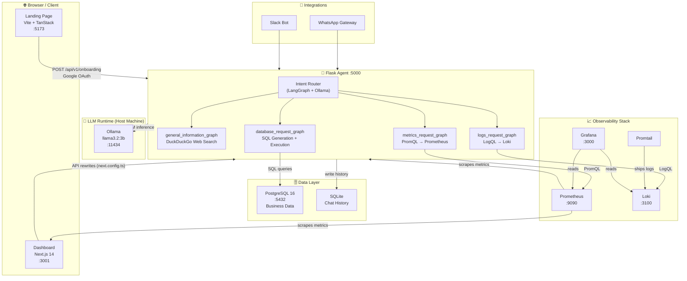
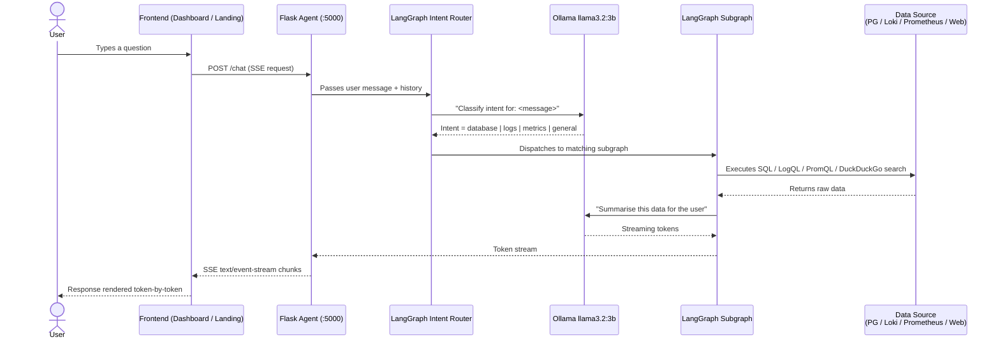

# 🏗️ ProfitPilot — Architecture Documentation

> This document is intended for new contributors who want to understand how ProfitPilot's components fit together before diving into the code.

---

## Table of Contents

- [System Overview](#system-overview)
- [Full System Diagram](#full-system-diagram)
- [Chat / Query Flow](#chat--query-flow)
- [Layer-by-Layer Explanation](#layer-by-layer-explanation)
- [Key Files for Contributors](#key-files-for-contributors)
- [Docker vs Manual Setup](#docker-vs-manual-setup)

---

## System Overview

ProfitPilot is composed of five logical layers:

1. **Frontend** — a landing page (Vite + TanStack) and an analytics dashboard (Next.js)
2. **Agent Backend** — a Flask server that hosts a LangGraph intent router and streams AI responses via SSE
3. **LLM Runtime** — Ollama running `llama3.2:3b` locally (outside Docker)
4. **Data Layer** — PostgreSQL for business data, SQLite for chat history
5. **Observability Stack** — Prometheus, Grafana, Loki, and Promtail for metrics and log monitoring

---

## Full System Diagram

---

## Chat / Query Flow

This diagram shows what happens from the moment a user types a message to when the streamed response appears in the browser.

### Intent Categories

| Intent | Trigger keywords (examples) | Subgraph | Data source |
|---|---|---|---|
| `database` | sales, revenue, employees, expenses | `database_request_graph` | PostgreSQL |
| `logs` | errors, logs, warnings, crashes | `logs_request_graph` | Loki (LogQL) |
| `metrics` | CPU, memory, latency, uptime | `metrics_request_graph` | Prometheus (PromQL) |
| `general` | anything else / web knowledge | `general_information_graph` | DuckDuckGo |

---

## Layer-by-Layer Explanation

### 1. Landing Page (`landing-page/` · port 5173)

Built with **Vite** and **TanStack Router**. Serves as the marketing site and business onboarding entry point. The `get-started.tsx` route sends onboarding form data to the Flask agent (`POST /api/v1/onboarding`) and handles Google OAuth on the client side.

### 2. Next.js Dashboard (`dashboard/` · port 3001)

Built with **Next.js 14 (App Router)**. Displays KPIs, charts, employee stats, and the AI chatbot interface. All `/api/*` requests are rewritten to the Flask agent via `next.config.ts`, so the dashboard never talks to PostgreSQL directly. Prometheus also scrapes the Next.js service for frontend metrics.

### 3. Flask Agent (`agent_code/` · port 5000)

The core backend. Responsibilities:

- Exposes REST endpoints consumed by both frontends
- Hosts the **LangGraph intent router** that classifies and routes user queries
- Streams AI responses back to the client using **Server-Sent Events (SSE)**
- Connects to PostgreSQL, Loki, and Prometheus on behalf of subgraphs

The `app.py` file is the entry point. Each intent lives in its own directory under `agent_code/intents/`.

### 4. LangGraph Intent Router (`agent_code/intents/`)

LangGraph orchestrates a stateful graph where:

1. An **intent detection node** calls Ollama to classify the user's query.
2. A **router node** dispatches to one of four subgraphs.
3. Each **subgraph** generates the appropriate query (SQL / LogQL / PromQL / search), executes it, then calls the LLM again to produce a human-readable answer.
4. The final **SSE node** streams tokens back through Flask.

State is defined in `agent_code/state/` and shared across all nodes in a subgraph.

### 5. Ollama LLM (host machine · port 11434)

Ollama runs **outside Docker** on the host machine and is reached by the Flask container via `host.docker.internal:11434`. The model in use is `llama3.2:3b` — a small, fast model suited for intent detection and concise business Q&A. The LLM abstraction lives in `agent_code/llm/`.

### 6. Data Layer

| Store | Purpose | Access |
|---|---|---|
| PostgreSQL 16 (`:5432`) | Business data — sales, employees, expenses, products | Flask agent via `db_config.py` |
| SQLite | Chat history per session | Flask agent, local file |

Schema is defined in `company_db_schema.sql`; seed data in `inserts.sql`.

### 7. Observability Stack

| Component | Role |
|---|---|
| **Prometheus** (`:9090`) | Scrapes metrics from Flask and Next.js; stores time-series data |
| **Promtail** | Tails log files and ships them to Loki |
| **Loki** (`:3100`) | Log aggregation backend; queried via LogQL |
| **Grafana** (`:3000`) | Unified dashboard reading from both Prometheus and Loki |

Config files: `prometheus.yml` (scrape targets), `promtail-config.yaml` (log paths).

### 8. Integrations

- **WhatsApp Gateway** (`whatsapp_gateway/`) — routes incoming WhatsApp messages to the Flask agent.
- **Slack Bot** (`agent_code/slack_integration/`) — allows querying ProfitPilot from a Slack workspace.

---

## Key Files for Contributors

| File | What it does | Why it matters |
|---|---|---|
| `agent_code/app.py` | Flask entry point, all API routes, SSE streaming | Start here to understand the backend |
| `agent_code/intents/database_request_graph/subgraph.py` | SQL generation + execution subgraph | Core query flow; known `AVAILABLE_TABLES` bug lives here |
| `agent_code/intents/logs_request_graph/utils.py` | Loki LogQL helper | Missing `import requests` (open bug) |
| `agent_code/intents/metrics_request_graph/utils.py` | Prometheus PromQL helper | Missing `import time` (open bug) |
| `agent_code/llm/` | Ollama LLM wrapper | Used by all subgraphs for inference |
| `agent_code/state/` | LangGraph shared state types | Required reading before editing any node |
| `agent_code/db_config.py` | PostgreSQL connection helpers | Referenced by database subgraph |
| `dashboard/src/app/chatbot/page.tsx` | Next.js chatbot UI | Critical SSE bug — open for contribution |
| `dashboard/next.config.ts` | API rewrites to Flask agent | Understand how Dashboard → Agent routing works |
| `landing-page/src/routes/get-started.tsx` | Onboarding form | Hardcodes `localhost:5000` (open bug) |
| `docker-compose.yml` | Full service orchestration | All ports, volumes, env wiring in one file |
| `prometheus.yml` | Prometheus scrape configuration | Controls which services are monitored |
| `company_db_schema.sql` | PostgreSQL DDL | Understand the data model before writing SQL subgraphs |

---

## Docker vs Manual Setup

| Aspect | Docker (`docker compose up`) | Manual |
|---|---|---|
| **Best for** | Full system testing, demos | Active development on a single service |
| **Services started** | All (Flask, Next.js, Landing, PostgreSQL, Grafana, Prometheus, Loki, Promtail, pgAdmin) | Only what you run |
| **Ollama** | Must run on host machine either way (`ollama serve`) | Must run on host machine |
| **Database setup** | Requires manual `docker cp` + `psql` steps after containers start | Requires local PostgreSQL + manual schema import |
| **Env files needed** | `.env` (root) + `agent_code/.env` | `agent_code/.env` with `localhost` URLs |
| **Port conflicts** | Watch for Grafana `:3000` vs Next.js `:3001` | Only active services occupy ports |

> **Tip for new contributors:** Run `docker compose up --build` once to verify everything works end-to-end, then stop the service you're editing and run it manually so you get fast reload cycles.

---

*Last updated for GSSoC'26. If you find anything out of date, please open an issue or PR!*
